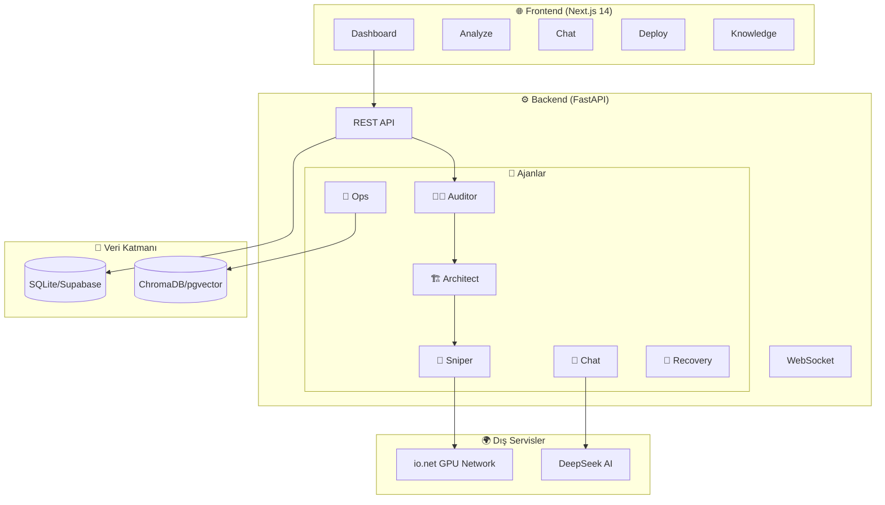

# io-Guard: Otonom GPU Orkestrasyon Platformu

<div align="center">


**Dağıtık GPU ağları için yapay zeka destekli orkestrasyon çözümü**

[](LICENSE)
[](https://github.com/aliozen0/sentinel-io)
[](https://www.docker.com/)
[](https://sentinel-io-guard.vercel.app/)

[🚀 Hızlı Başlangıç](#-hızlı-başlangıç) • [📖 Dokümantasyon](#-teknik-dokümantasyon) • [🎮 Demo](#-canlı-demo) • [💬 Destek](#-destek)

</div>

---

## 📋 İçindekiler

- [🎯 io-Guard Nedir?](#-io-guard-nedir)
- [✨ Temel Özellikler](#-temel-özellikler)
- [🚀 Hızlı Başlangıç](#-hızlı-başlangıç)
- [🔧 Kurulum Seçenekleri](#-kurulum-seçenekleri)
- [🎮 Canlı Demo](#-canlı-demo)
- [🏗️ Sistem Mimarisi](#️-sistem-mimarisi)
- [🤖 Ajan Sistemi](#-ajan-sistemi)
- [📚 Kullanım Örnekleri](#-kullanım-örnekleri)
- [🛡️ Güvenlik](#️-güvenlik)
- [📖 Teknik Dokümantasyon](#-teknik-dokümantasyon)
- [🗺️ Yol Haritası](#️-yol-haritası)
- [💬 Destek](#-destek)

---

## 🎯 io-Guard Nedir?

**io-Guard**, merkeziyetsiz GPU ağlarında (DePIN) çalışan makine öğrenimi iş yüklerini optimize eden **Ajan Tabanlı Katman-2** çözümüdür.

### 🎪 Çözdüğü Problem

Modern yapay zeka geliştiricileri şu sorunlarla karşılaşıyor:

- 💸 **Maliyet Karmaşıklığı:** Hangi GPU provider'ı seçmeli?
- 🔧 **Manuel Konfigürasyon:** Docker, CUDA, dependencies...
- 🔒 **Güvenlik Riskleri:** SSH key yönetimi, güvenli bağlantı
- ⏱️ **Zaman Kaybı:** Deploy sürecinde manuel adımlar

### ✅ io-Guard Çözümü

```
👨‍💻 Python Kodu → 🤖 Ajanlar Analiz Eder → 💰 En Ucuz GPU Bulur → 🚀 Otomatik Deploy
```

**3 akıllı ajan** tüm süreci otomatikleştirir:

1. **👨‍⚖️ Auditor:** Kodunuzu analiz eder (framework, VRAM, bağımlılıklar)
2. **🏗️ Architect:** Docker ortamını planlar (base image, CUDA versiyonu)
3. **🎯 Sniper:** En uygun GPU'yu bulur (fiyat/performans optimizasyonu)

---

## ✨ Temel Özellikler

<table>
<tr>
<td width="50%">

### 🤖 Otonom Ajanlar
- **Kod Analizi:** AST + LLM hibrit analiz
- **Piyasa Arbitrajı:** Gerçek zamanlı GPU fiyat taraması
- **Ortam Planlama:** Otomatik Docker konfigürasyonu
- **Self-Healing:** Hata durumunda akıllı kurtarma

</td>
<td width="50%">

### 🧠 RAG Hafızası (v1.5)
- **Doküman Yükleme:** PDF/TXT dosyalarınızı yükleyin
- **Semantik Arama:** Vektör tabanlı benzerlik
- **Tool Use Agent:** Sistem kontrolü ve RAG sorguları
- **Hibrit DB:** ChromaDB (local) / pgvector (cloud)

</td>
</tr>
<tr>
<td>

### 🔐 Güvenlik
- **Ephemeral Credentials:** SSH key'ler RAM'de
- **End-to-End Şifreleme:** SSHv2 + TLS 1.3
- **JWT Authentication:** Stateless token sistemi
- **Zero-Trust Mimarisi:** Her işlem doğrulanır

</td>
<td>

### 🚀 Kolay Deploy
- **Remote Execution:** SSH üzerinden kod çalıştırma
- **Live Streaming:** Gerçek zamanlı log akışı
- **Demo Mode:** Mock GPU server ile test
- **Multi-Model Chat:** DeepSeek, Llama, Qwen desteği

</td>
</tr>
</table>

---

## 🚀 Hızlı Başlangıç

### Gereksinimler

| Araç | Minimum Versiyon | İndirme |
|------|------------------|---------|
| 🐳 Docker Desktop | 20.10+ | [docker.com](https://www.docker.com/products/docker-desktop/) |
| 📦 Git | 2.0+ | [git-scm.com](https://git-scm.com/) |

### 3 Adımda Kurulum

```bash
# 1️⃣ Projeyi klonlayın
git clone https://github.com/aliozen0/sentinel-io.git
cd sentinel-io

# 2️⃣ Ortam değişkenlerini ayarlayın
cp .env.example .env
nano .env  # Supabase bilgilerinizi girin (veya SQLite için boş bırakın)

# 3️⃣ Sistemi başlatın
docker-compose up --build
```

**Tarayıcınızda açın:**
- 🖥️ **Frontend:** http://localhost:3000
- ⚙️ **Backend API:** http://localhost:8000/docs

> ⚠️ **Not:** İlk çalıştırmada Docker imajlarının indirilmesi 2-5 dakika sürebilir.

---

## 🔧 Kurulum Seçenekleri

### Seçenek 1: Supabase (Bulut) - Önerilen ⭐

**Avantajlar:**
- ✅ Kalıcı veri saklama
- ✅ RAG vektör desteği (pgvector)
- ✅ Çoklu kullanıcı
- ✅ Otomatik yedekleme

#### Kurulum Adımları

<details>
<summary><b>1. Supabase Projesi Oluştur</b></summary>

1. [supabase.com](https://supabase.com/) → **"New Project"**
2. Proje bilgilerini doldurun
3. Oluşturma sürecini bekleyin (~2 dakika)

</details>

<details>
<summary><b>2. API Anahtarlarını Al</b></summary>

**Settings → API** bölümünden:
- `SUPABASE_URL`
- `SUPABASE_KEY` (anon public)
- `SUPABASE_SERVICE_ROLE_KEY`
- `SUPABASE_JWT_SECRET` (JWT Settings)

</details>

<details>
<summary><b>3. Veritabanı Şemasını Yükle</b></summary>

**SQL Editor** → **New Query**
```sql
-- backend/supabase_setup.sql dosyasının içeriğini buraya yapıştırın
```
**Run** tuşuna basın ✅

</details>

<details>
<summary><b>4. .env Dosyasını Yapılandır</b></summary>

```bash
# io.net API (https://ai.io.net/ai/api-keys)
IO_API_KEY="sk-io-xxxxxxxx"
IO_BASE_URL="https://api.intelligence.io.solutions/api/v1/"
IO_MODEL_NAME="deepseek-ai/DeepSeek-V3.2"

# Supabase
SUPABASE_URL="https://xxx.supabase.co"
SUPABASE_KEY="eyJhbGciOiJIUzI1NiIsInR5cCI6IkpXVCJ9..."
SUPABASE_SERVICE_ROLE_KEY="eyJhbGciOiJIUzI1NiIsInR5cCI6IkpXVCJ9..."
SUPABASE_JWT_SECRET="your-jwt-secret"
```

</details>

### Seçenek 2: SQLite (Yerel) - Hızlı Test 🚀

**Avantajlar:**
- ✅ Sıfır konfigürasyon
- ✅ İnternet gerektirmez
- ✅ Anında başlangıç

**Kurulum:**
```bash
# .env dosyasında Supabase anahtarlarını boş bırakın
# Sistem otomatik olarak SQLite moduna geçer
IO_API_KEY="sk-io-xxxxxxxx"
IO_BASE_URL="https://api.intelligence.io.solutions/api/v1/"
IO_MODEL_NAME="deepseek-ai/DeepSeek-V3.2"
```

> ⚠️ **Uyarı:** Container yeniden başlatıldığında veriler kaybolur.

---

## 🎮 Canlı Demo

### 🌐 Online Demo
Yerel kurulum yapmadan denemek için:

- **Frontend:** https://sentinel-io-guard.vercel.app/
- **Backend API:** https://sentinel-io.onrender.com/docs

> ⚠️ **Free Plan Uyarısı:** Demo sunucular ücretsiz planda çalıştığı için ilk istekte 1-2 dakika uyandırma süresi olabilir.

### 🎯 Local Demo Mode

Gerçek GPU sunucularına bağlanmadan sistemi test edin:

1. **Deploy Sayfası:** http://localhost:3000/deploy
2. **"Live Mode ⚡"** seçin
3. **"🎮 Get Demo Server Credentials"** tıklayın
4. **"✨ Auto-Fill Connection"** ile formu doldurun
5. **"Test Connection"** ile doğrulayın
6. Artık kod çalıştırabilirsiniz!

**Demo server özellikleri:**
- ✅ Gerçek SSH protokolü
- ✅ SFTP dosya transferi
- ✅ Uzaktan komut çalıştırma
- ✅ Canlı log streaming

---

## 🏗️ Sistem Mimarisi



### 📊 Ajan Pipeline

```
📝 Python Kodu
    ↓
👨‍⚖️ Auditor (Kod Analizi)
    ├─ Framework: PyTorch
    ├─ VRAM: 16GB
    └─ Health Score: 92/100
    ↓
🏗️ Architect (Ortam Planlama)
    ├─ Base Image: pytorch:2.1-cuda12.1
    ├─ Python: 3.10
    └─ Dependencies: transformers, torch
    ↓
🎯 Sniper (Piyasa Arbitrajı)
    ├─ GPU Tarama: 47 node
    ├─ Fiyat Analizi: $1.20-$2.80/h
    └─ Seçim: A100 @ $1.45/h (Frankfurt)
    ↓
🚀 Deploy Ready!
```

---

## 🤖 Ajan Sistemi

### Ajan Detayları

<table>
<tr>
<th>Ajan</th>
<th>Görev</th>
<th>Teknoloji</th>
<th>Çıktı</th>
</tr>
<tr>
<td><b>👨‍⚖️ Auditor</b></td>
<td>Kod sağlığı analizi</td>
<td>AST + LLM</td>
<td>

```json
{
  "framework": "PyTorch",
  "vram_min_gb": 16,
  "health_score": 92
}
```

</td>
</tr>
<tr>
<td><b>🏗️ Architect</b></td>
<td>Ortam mühendisliği</td>
<td>Docker + CUDA</td>
<td>

```json
{
  "base_image": "pytorch:2.1",
  "cuda_version": "12.1",
  "packages": ["torch"]
}
```

</td>
</tr>
<tr>
<td><b>🎯 Sniper</b></td>
<td>Piyasa arbitrajı</td>
<td>io.net API</td>
<td>

```json
{
  "gpu_model": "A100",
  "cost_hourly": 1.45,
  "location": "Frankfurt"
}
```

</td>
</tr>
<tr>
<td><b>💬 ChatAgent</b></td>
<td>Genel destek</td>
<td>DeepSeek-V3</td>
<td>Teknik danışmanlık</td>
</tr>
<tr>
<td><b>🔧 OpsAgent</b></td>
<td>Sistem kontrolü</td>
<td>Tool Use</td>
<td>Bakiye, job yönetimi</td>
</tr>
<tr>
<td><b>🔄 Recovery</b></td>
<td>Hata çözümü</td>
<td>RAG + AI</td>
<td>Self-healing stratejileri</td>
</tr>
</table>

---

## 📚 Kullanım Örnekleri

### Örnek 1: PyTorch Model Analizi

```python
# train.py
import torch
import torch.nn as nn

model = nn.Sequential(
    nn.Linear(768, 1024),
    nn.ReLU(),
    nn.Linear(1024, 10)
)

# io-Guard Analyze sayfasına yükleyin
# Bütçe: $50
# Model: DeepSeek-V3
```

**Auditor Çıktısı:**
```
✅ Framework: PyTorch 2.0+
✅ VRAM: ~4GB (Tahmini)
✅ Dependencies: torch, numpy
⚠️  Öneri: Batch size 32 → 16 optimize edilebilir
```

**Sniper Önerisi:**
```
🎯 Best Match: RTX 4090 @ $0.89/h
📍 Location: Frankfurt, DE
⏱️  Latency: 18ms
💰 Maliyet: ~$42.72 (48h)
✅ Bütçe içinde!
```

### Örnek 2: RAG ile Hata Çözümü

```python
# Deployment hatası:
# CUDA out of memory

# RecoveryEngine devreye girer:
```

**RAG Çözümü:**
```
🔍 Benzer hata bulundu (Similarity: 0.94)
📄 Kaynak: cuda_optimization.pdf, Sayfa 23

💡 Önerilen çözümler:
1. Batch size'ı 32 → 16'ya düşür
2. torch.cuda.empty_cache() ekle
3. Gradient accumulation kullan (4 steps)

✅ Otomatik düzeltme uygulanıyor...
```

### Örnek 3: Multi-Model Chat

```
Kullanıcı: "VRAM gereksinimimi nasıl azaltırım?"

ChatAgent (DeepSeek-V3):
"Birkaç yöntem var:

1. **Model Quantization:** FP32 → FP16 veya INT8
   - `model.half()` ile %50 VRAM tasarrufu
   
2. **Gradient Checkpointing:**
   - `model.gradient_checkpointing_enable()`
   - Training'de %30-40 tasarruf
   
3. **Batch Size Azaltma:**
   - 32 → 16 → 8 test edin
   
4. **LoRA Fine-tuning:**
   - Tüm model yerine sadece adaptör eğit
   
Hangi yöntemi denemek istersin?"
```

---

## 🛡️ Güvenlik

### Zero-Trust Mimarisi

| Katman | Tehdit | Önlem | Teknoloji |
|--------|--------|-------|-----------|
| **Ağ** | Man-in-the-Middle | End-to-End Şifreleme | SSHv2 (AES-256) |
| **Veri** | DB Sızıntısı | Ephemeral Credentials | RAM-only storage |
| **API** | Brute Force | Rate Limiting | FastAPI Middleware |
| **Kimlik** | Token Hırsızlığı | JWT Rotation | Short-lived tokens |

### SSH Güvenliği

**Desteklenen Yöntemler:**
- 🔑 Private Key (RSA, Ed25519, ECDSA, DSA)
- 🔐 Password Authentication
- 🔒 Passphrase-Protected Keys

**Güvenlik Prensipleri:**
1. SSH key'ler **asla** veritabanına kaydedilmez
2. Sadece işlem süresince **RAM'de** tutulur
3. İşlem bitince güvenli şekilde **silinir** (wipe)
4. Tüm bağlantılar **şifreli tünel** üzerinden

---

## 📖 Teknik Dokümantasyon

Detaylı mimari ve implementasyon bilgileri için:

📄 **[io-Guard Technical Whitepaper v1.0](https://github.com/aliozen0/sentinel-io/blob/main/io-guard-technical-whitepaper-v1.pdf)**

**İçerik:**
- Sistem mimarisi detayları
- Ajan karar ağaçları
- Veri modeli ve şema
- Güvenlik protokolleri
- API spesifikasyonları
- Deployment stratejileri

---

## 🗺️ Yol Haritası

### ✅ Tamamlanan (v1.5)

- [x] Supabase bulut entegrasyonu
- [x] Canlı piyasa verisi (io.net API)
- [x] SSH güvenli bağlantı
- [x] Remote code execution
- [x] RAG hafıza sistemi
- [x] Tool Use agent (OpsAgent)
- [x] Self-healing mekanizması
- [x] Multi-model chat

### 🔄 Geliştirme Aşamasında (v2.0)

- [ ] **Multi-Cloud Support:** AWS Spot, RunPod, Akash
- [ ] **AMD GPU Desteği:** ROCm stack entegrasyonu
- [ ] **WebRTC Protocol:** Düşük gecikmeli streaming
- [ ] **Auto-Scaling:** Dinamik kaynak yönetimi
- [ ] **Cost Analytics Dashboard:** Detaylı maliyet raporları
- [ ] **Team Collaboration:** Paylaşımlı workspace'ler

### 🔮 Gelecek Vizyon (v3.0+)

- [ ] **Multi-Language Support:** Node.js, Go, Rust analizi
- [ ] **Kubernetes Orchestration:** K8s cluster yönetimi
- [ ] **ML Model Registry:** Pre-trained model marketplace
- [ ] **Blockchain Integration:** Akıllı kontrat tabanlı ödeme

---

## 💬 Destek

### 📞 İletişim

- 🐛 **Bug Report:** [GitHub Issues](https://github.com/aliozen0/sentinel-io/issues)
- 💡 **Feature Request:** [GitHub Discussions](https://github.com/aliozen0/sentinel-io/discussions)
- 📧 **Email:** [GitHub Profile](https://github.com/aliozen0)

### 📚 Kaynaklar

- **Canlı Demo:** https://sentinel-io-guard.vercel.app/
- **API Dokümantasyonu:** https://sentinel-io.onrender.com/docs
- **Teknik Whitepaper:** [PDF](https://github.com/aliozen0/sentinel-io/blob/main/io-guard-technical-whitepaper-v1.pdf)

### 🤝 Katkıda Bulunma

Katkılarınızı bekliyoruz! Lütfen:

1. Projeyi fork edin
2. Feature branch oluşturun (`git checkout -b feature/amazing-feature`)
3. Değişikliklerinizi commit edin (`git commit -m 'Add amazing feature'`)
4. Branch'inizi push edin (`git push origin feature/amazing-feature`)
5. Pull Request açın

---

## 📄 Lisans

Bu proje [MIT Lisansı](LICENSE) altında lisanslanmıştır.

---

<div align="center">

**⭐ Projeyi beğendiyseniz yıldız vermeyi unutmayın!**

Made with ❤️ by [Ali Özen](https://github.com/aliozen0)

</div>